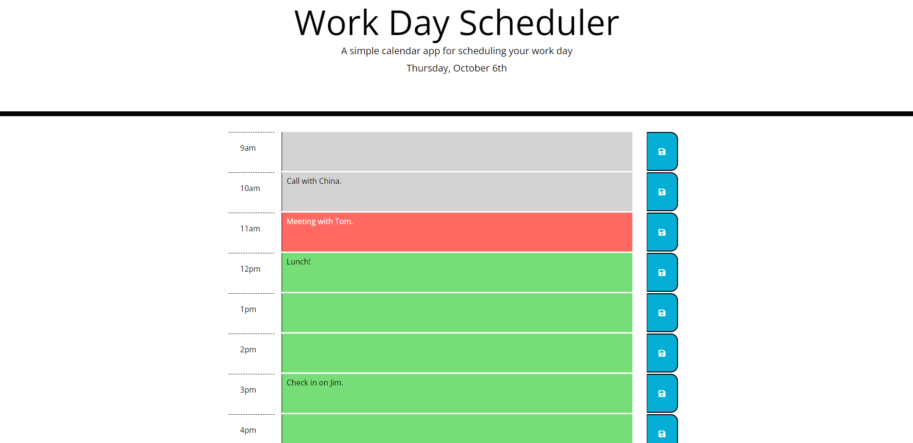

# Work Day Scheduler


## Description

This application is a scheduler for organizing the user's work day. The user can add events and save them to local storage by clicking the save icon. They can change the events as they please, and save those changes by reclicking the save icon. Furthermore, the color of the event's background reflects whether the hour of the event is in the past, present, or future. Finally, The following User Story and Acceptance Criteria is met:

## User Story

```md
AS AN employee with a busy schedule
I WANT to add important events to a daily planner
SO THAT I can manage my time effectively
```

## Acceptance Criteria

```md
GIVEN I am using a daily planner to create a schedule
WHEN I open the planner
THEN the current day is displayed at the top of the calendar
WHEN I scroll down
THEN I am presented with timeblocks for standard business hours
WHEN I view the timeblocks for that day
THEN each timeblock is color coded to indicate whether it is in the past, present, or future
WHEN I click into a timeblock
THEN I can enter an event
WHEN I click the save button for that timeblock
THEN the text for that event is saved in local storage
WHEN I refresh the page
THEN the saved events persist
```

The webpage looks as following:

## Example of a Work Day Schedule


## Installation

No Installation is needed to view and use this webpage.

## Usage

In order to access the website, visit:

https://cornetj13.github.io/work-day-scheduler/

## Credits

This project was designed by the UW fullstack bootcamp and was fully implemented by me. I referenced W3 Schools for JavaScript methods and functionality:

https://www.w3schools.com/

The JavaScript library JQuery was used for DOM traversal and manipulation:
https://jquery.com/

Bootstrap was used for CSS:
https://getbootstrap.com/

Google Fonts was used for fonts:
https://fonts.google.com/

The save icon is from Font Awesome:
https://fontawesome.com/

## License

Please refer to the LICENSE in the repo.